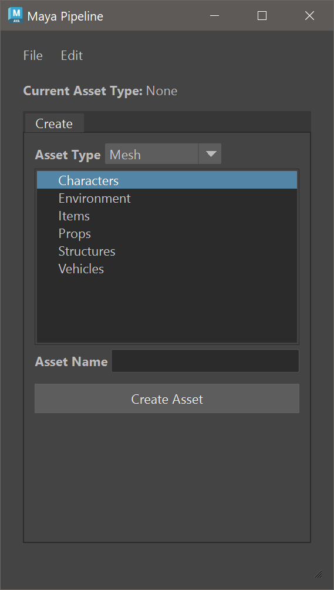
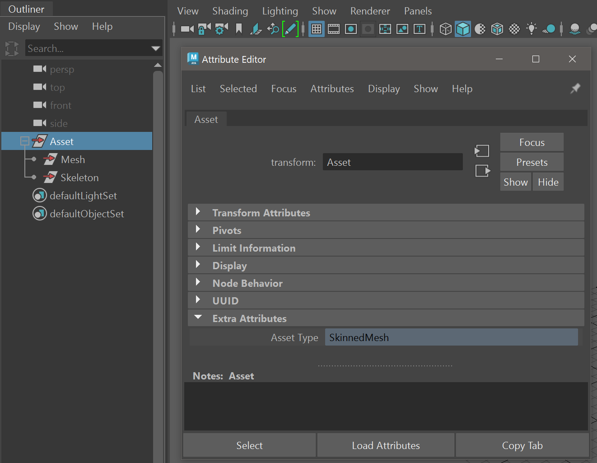

# Overview

The following is my example of an art pipeline for creating assets in Maya and exporting them to Unity. The focus is on UI development, and automating repetitive tasks. It features:
* Maya Dockable Main Window UI:
    * Loading a UI from code generated in Qt Designer.
    * Creating, showing, restoring, and destroying a Dockable Window safely.
    * Scaling UI Widgets based on Maya's DPI Settings.
* Automating asset creation, importing, referencing, and naming conventions for different asset types.
* Automating the export of assets to a Unity project with a single click:
   * No need to navigate dir trees to choose where to export or what to name the file.
   * Mesh Export: normal meshes or static meshes.
   * Animation Export: Baking animation, removing the rig, and exporting only the skeleton.
* Assigning attributes in Maya that can be parsed in Unity to automate animation import settings, and prefab creation for static meshes.
* Memory Management to delete and reload a Python module without restarting Maya.

The repo includes:
* A PyCharm project (v. 2021.3.3) with a Python Package named `maya_pipeline`.
* A UnityProject with scripts for processing assets during import.

Dependencies:
* Maya 2023 (May be compatible with earlier versions, but untested)
* Qt Designer 5.14.1
* Unity 2022.3.10f1

# Maya Pipeline Package

The Maya Pipeline Workspace Control uses a Model View Controller pattern described below.

## Main App

The entry point for the `MayaPipeline` object inside `main_app.py` is the function:

**[main_app.py](PyCharmProject/art_pipeline/maya/maya_pipeline/main_app/main_app.py)**
```python
def open_mp(title: str, mode: mp.UI_Creation_Mode) 
```

The default way a user should launch the UI from Maya is like this:

```python
import userSetup
import maya_pipeline as mp

mp.open_mp("Maya Pipeline", mp.UI_Creation_Mode.DEFAULT)
```

If you are actively changing code, first run this command to clean up any objects in memory and reload the package modules:

```python
import memory_management

memory_management.cleanup_memory()
```

Then run this command to destroy any existing Maya Pipeline UI and recreate it from scratch:

```python
import userSetup
import maya_pipeline as mp

mp.open_mp("Maya Pipeline", mp.UI_Creation_Mode.RECREATE)
```

The `mp.open_mp` function creates a MayaPipeline object like so:
```python
class MayaPipeline:
    def __init__(self, title: str, mode: mp.UI_Creation_Mode):
        mp.debug_log("\nInitializing MayaPipeline...")
        self.model = mp.MainModel()
        self.main_view = mp.MainView(title, mode=mode)
        self.main_controller = mp.MainController(self.model, self.main_view)
        mp.debug_log("\nFinished initializing MayaPipeline.")


mp_obj: MayaPipeline = None


def open_mp(title: str, mode: mp.UI_Creation_Mode):
    global mp_obj

    mp.debug_log(f"\nOpening Maya Pipeline(title={title}, mode={mode})...")

    if mode == mp.UI_Creation_Mode.DEFAULT:
        if not mp_obj:
            # If UI doesn't exist, then create it
            mp.debug_log("Creating UI from scratch")
            mp_obj = mp.MayaPipeline(title=title, mode=mp.UI_Creation_Mode.DEFAULT)
            mp_obj.main_view.ui.on_dock_closed.connect(on_close)
            return
        # Restore the UI that exists (i.e. was previously closed)
        mp.debug_log("Restoring UI that exists")
        mp_obj.main_view.ui = mp.create_workspace_control_with_dockable_main_win(
            title, ui_main_window=mp.Ui_MainWindow, mode=mp.UI_Creation_Mode.DEFAULT)
        mp_obj.model = mp.MainModel()
        mp_obj.main_controller = mp.MainController(mp_obj.model, mp_obj.main_view)
        mp_obj.main_view.ui.on_dock_closed.connect(on_close)
        mp_obj.main_view.ui.on_dock_closed.connect(on_close)
    elif mode == mp.UI_Creation_Mode.RESTORE_FROM_MAYA_PREFS:
        # When Maya starts create the UI and restore its previous state when Maya quit
        mp_obj = mp.MayaPipeline(title=title, mode=mp.UI_Creation_Mode.RESTORE_FROM_MAYA_PREFS)
        mp_obj.main_view.ui.on_dock_closed.connect(on_close)
    elif mode == mp.UI_Creation_Mode.RECREATE:
        # Destroy any existing UI and recreate the UI (for developers)
        mp_obj = mp.MayaPipeline(title=title, mode=mp.UI_Creation_Mode.RECREATE)
```

The resulting UI in Maya should look like this:



The UX for creating an asset is to:
1. Select an **Asset Type**. Types include:
    * Mesh
    * Skeleton
    * SkinnedMesh
    * Rig
    * Animation
2. Select a **Parent Folder** to save the asset inside of. Assets are saved in container folders beneath these parent folders. For example:
    * **Characters** (Parent)
        * **JaneDoe** (Asset Container Folder)
            * **JaneDoe_MSH.ma** (Mesh Asset File)
3. Enter an **Asset Name**. 
4. Click **Create Asset**

Each asset type has a suffix that is automatically added to the asset file name.

<table>
  <tr>
   <td><strong>Asset Type</strong>
   </td>
   <td><strong>Suffix</strong>
   </td>
  </tr>
  <tr>
   <td>Mesh
   </td>
   <td>_MSH
   </td>
  </tr>
  <tr>
   <td>Skeleton
   </td>
   <td>_SKL
   </td>
  </tr>
  <tr>
   <td>SkinnedMesh
   </td>
   <td>_SKM
   </td>
  </tr>
  <tr>
   <td>Rig
   </td>
   <td>_RIG
   </td>
  </tr>
  <tr>
   <td>Animation
   </td>
   <td>/NA
   </td>
  </tr>
</table>


## Model

This is the class where most of the functionality resides for creating, referencing, importing, and exporting assets. 

The asset creation approach entails:
1. Check that a Parent Folder has been selected and an asset name has been entered.
2. Save any changes to any currently open scene.
3. Based on what type of asset is being created, prompt the user to choose to import or reference other assets:
   - Mesh
      - The file is simply created
   - Skeleton
      - A prompt asks the user if they want to reference a mesh to aid with laying out the skeleton.
   - Skinned Mesh
      - A prompt asks to import a skeleton and import a mesh.
   - Rig
      - A prompt asks to import a skinned mesh
   - Animation
      - A prompt asks to reference a rig

**[main_model.py](PyCharmProject/art_pipeline/maya/maya_pipeline/main_app/main_model.py)**
```python
# Prompt user to choose to import or ref other assets based on what type of asset they are creating
if self.new_asset_type == AssetType.SKELETON:
    mesh_path_selected = self._perform_operation_on_current_or_different_asset(Operation.REFERENCE, AssetType.MESH)
    if mesh_path_selected:
        assets_to_import_or_ref.append(AssetsToImportOrRef(Operation.REFERENCE, mesh_path_selected))
elif self.new_asset_type == AssetType.SKINNED_MESH:
    mesh_path_selected = self._perform_operation_on_current_or_different_asset(Operation.IMPORT, AssetType.MESH)
    if mesh_path_selected:
        assets_to_import_or_ref.append(AssetsToImportOrRef(Operation.IMPORT, mesh_path_selected))
    skeleton_path_selected = self._perform_operation_on_current_or_different_asset(Operation.IMPORT, AssetType.SKELETON)
    if skeleton_path_selected:
        assets_to_import_or_ref.append(AssetsToImportOrRef(Operation.IMPORT, skeleton_path_selected))
elif self.new_asset_type == AssetType.RIG:
    skinned_mesh_path_selected = self._perform_operation_on_current_or_different_asset(Operation.IMPORT, AssetType.SKINNED_MESH)
    if skinned_mesh_path_selected:
        assets_to_import_or_ref.append(AssetsToImportOrRef(Operation.IMPORT, skinned_mesh_path_selected))
elif self.new_asset_type == AssetType.ANIMATION:
    rig_path_selected = self._perform_operation_on_current_or_different_asset(Operation.REFERENCE, AssetType.RIG)
    if rig_path_selected:
        assets_to_import_or_ref.append(AssetsToImportOrRef(Operation.REFERENCE, rig_path_selected))
        self.current_rig_ref_path = rig_path_selected
```

4. Create a file with an asset node and an extra attribute specifying the asset type. 


```python
# Create Asset Node
self.current_asset_node = self._create_current_asset_node(asset_type=self.new_asset_type)

# Add Attributes to Asset Node
self._add_attr_to_asset_node(ASSET_TYPE_ATTR_NAME, mp.AttributeType.String, self.new_asset_type.value)
```

5. Prompt the user to add any additional extra attributes: 
    6. Mesh: Is this a static mesh?
    7. Animation: Is the animation meant to loop?

```python
if self.new_asset_type == AssetType.MESH:
    is_static = self._yes_no_prompt("Will this be a static mesh?")
    if is_static is Response.YES:
        self._add_attr_to_asset_node(STATIC_ATTR_NAME, mp.AttributeType.Boolean, True)
if self.new_asset_type == AssetType.ANIMATION:
    is_looping = self._yes_no_prompt("Will this animation loop?")
    if is_looping is Response.YES:
        self._add_attr_to_asset_node(LOOP_ATTR_NAME, mp.AttributeType.Boolean, True)
```

6. Reference or import any assets the user selected. When assets are imported, their asset nodes are renamed to match their type, and they are parented under the asset node of the current file. For example a skinned mesh file would have this hierarchy after importing a skeleton and mesh:




```python
# Ref or Import Assets
references: list[pm.FileReference] = []

for asset in assets_to_import_or_ref:
    if asset.operation is Operation.IMPORT:
        self._import_asset_node_from_file(asset.path)
    elif asset.operation is Operation.REFERENCE:
        references.append(self._ref_asset_from_file(asset.path))

# Move Imported / Referenced Assets to Asset Node
self._move_imported_nodes_to_asset_node()
self._move_ref_nodes_to_asset_node(references)
```


## View

This View creates the Workspace Control, appends the UI widgets to the control, and scales the widgets based on the DPI setting.

**[main_view.py](PyCharmProject/art_pipeline/maya/maya_pipeline/main_app/main_view.py)**

```python
class MainView(QMainWindow):
    def __init__(self, title: str, mode: mp.UI_Creation_Mode):
        super().__init__()
        self.ui: mp.DockableMainWindow = mp.create_workspace_control_with_dockable_main_win(title, mp.Ui_MainWindow(), mode)
        self.parent_widgets: list[QWidget] = []
        self.parent_widgets.append(self.ui.ui_main_window.menubar)
        self.parent_widgets.append(self.ui.ui_main_window.centralwidget)
        self.parent_widgets.append(self.ui.ui_main_window.statusbar)
        self.setup_ui()

    def setup_ui(self):
        # Setup UI
        self.ui.setWindowTitle(self.ui.title)

        # Layout widgets
        layout = QVBoxLayout()

        for widget in self.parent_widgets:
            layout.addWidget(widget)

        self.ui.setLayout(layout)

        main_window_widget: QWidget = self.ui.ui_main_window.centralwidget.parentWidget()
        all_widgets = main_window_widget.findChildren(QObject)
```

### DPI Scaling

On high DPI monitors Maya's UI can appear very small. It can be scaled up via **Preferences > Interface > Interface Scaling**. This scales up Maya's internal UIs, but it will not scale custom user created UIs. The Qt functions for auto-scaling don't work at present in Maya 2023 🙁. This is a major pain, and something I hope Autodesk remedies. The following code in **main_view.py** is basic functionality for scaling up the UI. You may run into situations where it isn't perfect and needs adjusting:

**[main_view.py](PyCharmProject/art_pipeline/maya/maya_pipeline/main_app/main_view.py)**
```python
# Query Maya's current DPI scaling mode.
if pm.mayaDpiSetting(query=True, mode=True) == 1:  # 1 == Custom scaling
   # Query the current scale value and use it to scale the UI widgets
   scale_value: int = pm.mayaDpiSetting(query=True, scaleValue=True)
   mp.scale_qobjects(all_widgets, scale_value)
```

**[pyside_utilities.py](PyCharmProject/art_pipeline/maya/maya_pipeline/misc/pyside_utilities.py)**
```python
def scale_qobjects(objs: list[QObject], scale_value: int):
    if scale_value > 1:
        for obj in objs:
            if isinstance(obj, QToolBar):
                toolbar = obj
                toolbar.setIconSize(toolbar.iconSize() * scale_value)
            elif isinstance(obj, QWidget):
                obj.setMinimumSize(obj.minimumWidth() * scale_value, obj.minimumHeight() * scale_value)
            elif isinstance(obj, QLayout):
                margins = list(obj.getContentsMargins())
                margins = [float(margin) for margin in margins]

                for i in range(len(margins)):
                    margins[i] *= scale_value

                margins = [round(margin) for margin in margins]
                obj.setContentsMargins(margins[0], margins[1], margins[2], margins[3])
```
## UI Design
### Qt Toolkit

To provide context for how the Maya UI works,, the following is an overview of the Qt Toolkit that Maya uses for creating UI. Qt is a C++ cross-platform toolkit that provides Python bindings to the C++ code. The relevant parts include:

* **Qt Designer** is a visual tool for designing and building GUIs with Qt Widgets.
    * Quick Start: [https://doc.qt.io/qt-5/designer-quick-start.html](https://doc.qt.io/qt-5/designer-quick-start.html) 
    * Manual: [https://doc.qt.io/qt-5/qtdesigner-manual.html](https://doc.qt.io/qt-5/qtdesigner-manual.html)
* **Qt for Python** is the project that provides the official set of Python bindings (PySide) to the C++ toolkit. 
    * Documentation: [https://doc.qt.io/qtforpython-5/](https://doc.qt.io/qtforpython-5/)
* **PySide2** is a version of Qt for Python that provides **Qt 5.15.2** Python bindings.
    * The customized version of PySide2 used with Maya can be found here: [https://github.com/autodesk-forks/pyside-setup/releases/tag/Maya2023](https://github.com/autodesk-forks/pyside-setup/releases/tag/Maya2023)
    * More info in docs: [https://help.autodesk.com/view/MAYAUL/2023/ENU/?guid=Maya_SDK_Maya_Python_API_Working_with_PySide_in_Maya_html](https://help.autodesk.com/view/MAYAUL/2023/ENU/?guid=Maya_SDK_Maya_Python_API_Working_with_PySide_in_Maya_html) 


### Qt Designer

To install and run:
1. From a Python Terminal run  `pip install PyQt5Designer`
2. To find out where it was installed run  `pip show PyQt5Designer`  
3. Start `Designer.exe`

To view my example Main Window open the [main_view.ui](PyCharmProject/art_pipeline/maya/maya_pipeline/main_app/main_view_ui.py) file. 

To create your own Main Window the basic steps are:
1. **File > New > Template/Forms > Main Window**
2. Add a layout, some buttons, etc. to the widget.
3. Save the .ui file

You can then generate Python code from this .ui file that can be loaded into Maya. My example of this is in `main_view_ui.py`. 

To generate your own Python code:
1. Select the **Form menu > View Python Code...**
2. Copy the code.
3. Paste into your module similar to my example `main_view_ui.py` 

## Dockable Main Window

Many examples of Dockable Workspace Controls in Maya are limited and can bug out, and the documentation doesn't explain very well how things like the "uiScript" and "restoring" work, and assume that you aren't changing code and are simply loading the UI from a module when Maya starts. For example, the official Autodesk Maya 2023 example in the devkit `dockableWorkspaceWidget.py` contains bugs where you can't re-run the code. My `dockable_main_window.py` module provides functionality that makes clear distinctions between the different modes by which a control can be created. 

This function is used for creating a PySide dockable main window inside a Maya workspace control:

**[dockable_main_window.py](PyCharmProject/art_pipeline/maya/maya_pipeline/misc/dockable_main_window.py)**
```python
def create_workspace_control_with_dockable_main_win(title: str, 
                                                    ui_main_window:QMainWindow, 
                                                    mode:mp.UI_Creation_Mode) -> DockableMainWindow:
```


The `mode` parameter determines how the control is created:
* `DEFAULT` mode is what users should use. It creates a new control, or restores an existing control.
* `RECREATE` mode is for devs that have changed code and need to destroy and recreate the window safely.
* `RESTORE_FROM_MAYA_PREFS` mode is not meant to be called directly, and is only meant to be called from the `uiScript` command which saves the command in Maya prefs, so when Maya restarts it can restore the control.

The function returns a `DockableMainWindow` object. The `ui_main_window` argument should be a reference to the `Ui_MainWindow` class generated by Qt Designer. Here is the body of the function:

```python
    dockable_main_win: DockableMainWindow = None
    workspace_control_name = get_workspace_control_name(title)

    if mode is mp.UI_Creation_Mode.DEFAULT:
        if workspace_control_exists(workspace_control_name):
            restore_workspace_control(workspace_control_name)

            workspace_control_widget: QWidget = None
            maya_main_window_ptr = omui.MQtUtil.mainWindow()
            maya_main_window = wrapInstance(int(maya_main_window_ptr), QWidget)

            # Have to keep this code in this location or the widget may go out of scope and get deleted.
            for child_widget in maya_main_window.findChildren(QWidget):
                if child_widget.objectName() == workspace_control_name:
                    workspace_control_widget = child_widget  # Found workspace control widget
                    break

            dockable_main_win = get_dockable_main_win_child(workspace_control_widget)
        else:
            mp.debug_log(f"Workspace Control: {workspace_control_name} doesn't exist. Creating it from scratch...")
            dockable_main_win = create_dockable_main_win(title=title, ui_main_window=ui_main_window)
            create_workspace_control(title, dockable_main_win)
    elif mode is mp.UI_Creation_Mode.RESTORE_FROM_MAYA_PREFS:
        mp.debug_log("Restoring from Maya prefs...")
        # Unlike the modes above, we don't destroy the existing control because it's stored in Maya General.json
        # and will throw an Access Violation.
        dockable_main_win = create_dockable_main_win(title=title, ui_main_window=ui_main_window)
        # Get the current maya control that the mixin widget should parent to
        restored_control = omui.MQtUtil.getCurrentParent()
        # Find the widget created above as a maya control (aka a maya class)
        mixin_ptr = omui.MQtUtil.findControl(dockable_main_win.objectName())
        # Add custom mixin widget to the workspace control
        omui.MQtUtil.addWidgetToMayaLayout(int(mixin_ptr), int(restored_control))
    elif mode is mp.UI_Creation_Mode.RECREATE:
        mp.debug_log("Recreating window...")
        # Force the workspace control to be recreated during development
        if workspace_control_exists(workspace_control_name):
            mp.debug_log(f"Deleting workspace control: {workspace_control_name}")
            delete_workspace_control_widgets(workspace_control_name)
            delete_workspace_control(workspace_control_name)

        dockable_main_win = create_dockable_main_win(title=title, ui_main_window=ui_main_window)
        create_workspace_control(title, dockable_main_win)
    else:
        mp.debug_error(f"mode={mode} unsupported.", print_to_script_editor=True)

    if dockable_main_win is None:
        mp.debug_error("dockable_main_win == None", print_to_script_editor=True)

    mp.debug_log("Finished running dockable_main_win_script()")

    return dockable_main_win
```

## Controller

The main controller basically just connects the View to the Model and vice versa.

**[main_controller.py](PyCharmProject/art_pipeline/maya/maya_pipeline/main_app/main_controller.py)**


## Exporting

The following problem commonly occurs as a project evolves: At the beginning the Maya and Unity Projects have well organized directory structures. As the project scales the structures begin to diverge and become different. Artists mistype or choose arbitrary names for folders or assets, and over time it becomes increasingly difficult to identify what file an asset was exported from.

To solve for this, the export location can be saved in **Edit > Settings** and the **File > Export** command exports the asset to a directory structure that directly mirrors the Maya project. The setting is saved in `Settings.json`. For cases where a user needs to manually select an export path, they can use **File > Export to Custom Location**.

Meshes and skinned meshes nodes are exported as-is. However, animations have a more complex export process. Each animation contains a reference to a rig. We begin by importing this reference. From there we bake the animation on the skeleton. With the anim baked, we can now delete any constraints and finally delete the rig, leaving behind only the skeleton for export:

```python
 def _export_animation(node: pm.PyNode, export_filepath: Path):
    try:
        mp.debug_log("Exporting Animation...")

        # Find the rig
        rig_node = _get_descendent_of_asset_type(node, mp.AssetType.RIG)
        if not rig_node:
            mp.debug_error("Didn't find rig node.", print_to_script_editor=True)
            return

        rig_ref_node = pm.referenceQuery(rig_node, referenceNode=True)
        rig_ref = pm.FileReference(rig_ref_node)

        if not rig_ref:
            mp.debug_error("No rig reference found.", print_to_script_editor=True)
            return

        # Import rig and remove its namespace
        rig_ref.importContents(removeNamespace=True)

        # Find the skeleton
        skeleton_node = _get_descendent_of_asset_type(node, mp.AssetType.SKELETON)
        if not skeleton_node:
            mp.debug_error("No skeleton found.", print_to_script_editor=True)
            return

        # Move Skeleton under the Asset node
        skeleton_node.unlock()
        skeleton_node.setParent(node)

        # Bake animation
        joints = pm.listRelatives(skeleton_node, allDescendents=True, type="joint")
        _bake_joints(joints)  # Bake animation on skeleton

        # Delete constraints
        _delete_constraints_in_descendents(skeleton_node)

        # Delete rig
        _unlock_node_and_descendents(rig_node)
        pm.lockNode(rig_node, lock=False)
        rig_node.unlock()
        pm.delete(rig_node)

        _export_fbx(node, export_filepath, fbx_preset="animation.fbxexportpreset")
    except Exception as e:
        mp.debug_error(f"Exception during animation export: {e}", print_to_script_editor=True)
    else:
        mp.debug_log("Finished animation export.")
```

To avoid human error when choosing FBX export settings an appropriate FBX preset is loaded and used during export, based on the asset type. Finally, to preserve our work, we close the file without saving our destructive changes and re-open the original file:

```python
def _export_fbx(node: pm.PyNode, export_filepath: Path, fbx_preset: str):
    pm.select(node, replace=True)

    mp.debug_log(f"Trying to export FBX to: {export_filepath}.fbx")
    try:
        export_filepath.parent.mkdir(parents=True, exist_ok=True)
        pm.mel.FBXLoadExportPresetFile(f=FBX_PRESETS_PATH / fbx_preset)
        pm.mel.FBXExport(f=export_filepath, s=True)
    except Exception as e:
        mp.debug_error(f"Exception during export: {e}", print_to_script_editor=True)
        _reopen_current_file()
    else:
        mp.debug_log(f"Exported: {export_filepath}.fbx", print_to_script_editor=True)
        _reopen_current_file()
```
## Memory Management

During development you often need to reload a module to test code changes. The Python `importlib.reload()` is typically the function to use for achieving this. However, with a large Python Package with lots of modules, reloading can be problematic. For example, reloading can cause Enum IDs to be regenerated and as a result objects making comparisons to old IDs won't work.  The workaround for this is to delete all the Package objects and modules and then re-import the Package.

The **[memory_management.py](PyCharmProject/art_pipeline/maya/memory_management.py)** module can be used like so to cleanup the Maya Pipeline Package:

**Maya Shelf Button**

```python
import memory_management

memory_management.cleanup_memory()
```

The first step of this function is to clean up the Maya Pipeline Workspace Control. If you simply delete the control sometimes the widgets inside the DockableMainWindow remain in memory and are Garbage Collected at some indeterminate time. Forcing Garbage Collection has no effect on these objects. So we delete the widgets first, and then delete the control:

```python
def _cleanup_workspace_control(title: str):
    print(f"Cleanup Workspace Control: {title}...")
    import maya_pipeline as mp
    workspace_control_name = mp.get_workspace_control_name(title)
    mp.delete_workspace_control_widgets(workspace_control_name)
    mp.delete_workspace_control(workspace_control_name)
```

After this, additional functions are called to cleanup Script Jobs, and the Maya Pipeline object. Finally we delete all the Package modules. One improvement I'd like to make is to automatically find all the modules on disk. But for now, there is a simple list of module names that is used for deleting modules in memory.

# Unity Project

Extra attributes added in Maya can be parsed when importing an FBX to Unity. This allows us to pass meta data and perform custom operations on import. Unity refers to these attributes as user properties. A future refinement I'd like to make is to replace the current flat dictionary of properties, and instead add a single string attribute in Maya and then set its value to be a JSON string. This would allow for more complex nested properties and easier parsing in Unity: 

**[AssetPostProcessor.cs](UnityProject/Assets/Scripts/Editor/AssetPostProcessor.cs)**
```csharp
void OnPostprocessGameObjectWithUserProperties(GameObject go, string[] propNames, object[] values)
{
    //Parse the Maya Extra Attributes (i.e. User Properties) in the FBX.     
    //We're only interested in the first root gameobject in the FBX hierarchy (where the Extra Attributes were added in Maya)
    if (checked_first_object)
    {
        return;
    }

    checked_first_object = true;

    ModelData.userProperties.Clear();

    //The first property is the Asset Type
    if (propNames[0] == ModelData.AssetTypeKey)
    {
        for (int i = 0; i < propNames.Length; i++)
        {
            ModelData.userProperties.Add(propNames[i], values[i]);
        }
    }
}
```

## Importing Static Meshes

A common operation performed by artists is creating a prefab for a static mesh (e.g. a building) and setting the mesh renderers to be static. Marking these renderers static is also commonly forgotten. The following code allows an artist to right click an FBX and create a prefab, and if its user properties have `static = True`, then auto set the renderers to be static.

**[PrefabCreation.cs](UnityProject/Assets/Scripts/Editor/PrefabCreation.cs)**
```csharp
public static class PrefabCreation
{
    [MenuItem("Assets/Create Mesh Prefab")]
    public static void CreateMeshPrefabMenuItem()
    {
        Object[] selectedAssets = Selection.GetFiltered(typeof(Object), SelectionMode.Assets);
        CreateMeshPrefab(selectedAssets[0]);
    }

    public static void CreateMeshPrefab(Object fbxAsset)
    {
        string fbxPath = AssetDatabase.GetAssetPath(fbxAsset);
        Debug.Log($"Importing: {fbxPath}");
        AssetDatabase.ImportAsset(fbxPath);

        if (ModelData.AssetType == ModelData.AssetTypes.Mesh)
        {
            string prefabPath = CreatePrefab(fbxAsset);

            if (ModelData.MeshProperties.Static)
            {
                Debug.Log($"{fbxPath} is a static mesh.");
                SetStatic(prefabPath);
            }
        }
    }

    private static string CreatePrefab(Object fbxAsset)
    {
        string fbxPath = AssetDatabase.GetAssetPath(fbxAsset);
        GameObject fbxMainAsset = (GameObject)AssetDatabase.LoadMainAssetAtPath(fbxPath);
        string prefabName = $"{fbxMainAsset.name}_PFB";
        GameObject prefabRootGO = new GameObject(prefabName);
        string prefabPath = Path.Combine(Path.GetDirectoryName(fbxPath), prefabRootGO.name + ".prefab");
        PrefabUtility.SaveAsPrefabAssetAndConnect(prefabRootGO, prefabPath, InteractionMode.AutomatedAction);

        //Edit the Prefab to put the FBX inside it
        using (var editingScope = new PrefabUtility.EditPrefabContentsScope(prefabPath))
        {
            var prefabRoot = editingScope.prefabContentsRoot;
            GameObject instantiatedFbx = PrefabUtility.InstantiatePrefab(fbxMainAsset) as GameObject;
            instantiatedFbx.transform.parent = prefabRoot.transform;
        }

        Object.DestroyImmediate(prefabRootGO);

        Debug.Log("Created prefab: " + prefabPath);
        return prefabPath;
    }

    private static void SetStatic(string prefabPath)
    {
        using (var editingScope = new PrefabUtility.EditPrefabContentsScope(prefabPath))
        {
            var flags = StaticEditorFlags.ContributeGI
                        | StaticEditorFlags.OccluderStatic
                        | StaticEditorFlags.BatchingStatic
                        | StaticEditorFlags.OccludeeStatic
                        | StaticEditorFlags.ReflectionProbeStatic;

            var prefabRoot = editingScope.prefabContentsRoot;
            Transform[] allChildren = prefabRoot.transform.GetComponentsInChildren<Transform>();

            foreach (Transform child in allChildren)
            {
                if (child.GetComponent<Renderer>())
                {
                    GameObjectUtility.SetStaticEditorFlags(child.gameObject, flags);
                }
            }
        }
    }
}
```

## Importing Animations

Another easy setting for artists to overlook is marking an animation like a walk cycle to loop. To automate this we add a loop boolean extra attribute in Maya when creating an animation. And on import we check its value, and if True we auto set the animation to loop:

**[AssetPostProcessor.cs](UnityProject/Assets/Scripts/Editor/AssetPostProcessor.cs)**
```csharp
void OnPreprocessAnimation()
{
    if (ModelData.AssetType == ModelData.AssetTypes.Animation)
    {
        ModelImporter modelImporter = assetImporter as ModelImporter;
        Debug.Log($"PreProcessingAnimation for {modelImporter.assetPath}");
        ModelImporterClipAnimation[] clipAnimations = modelImporter.defaultClipAnimations;

        for (int i = 0; i < clipAnimations.Length; i++)
        {
            bool loop = ModelData.AnimationProperties.Loop;

            if (loop)
            {
                Debug.Log($"- Setting clip: {clipAnimations[i].name}.loopTime = {loop}");
                clipAnimations[i].loopTime = loop;
            }
        }

        modelImporter.clipAnimations = clipAnimations;
        modelImporter.SaveAndReimport();
    }
}
```
